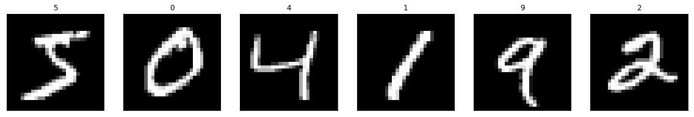
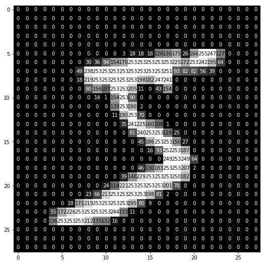

# Digits Recognition in Real Time
This python application recognizes digits from real time webcam data. The user is allowed to write the digits on the screen using an object-of-interest (a water bottle cap in this case).

## Code Requirements
The code is in Python (version 3.6 or higher). You also need to install OpenCV and Keras libraries.

## Description
A popular demonstration of the capability of deep learning techniques is object recognition in image data.

The "Hello World" of object recognition for machine learning and deep learning is the [MNIST dataset](https://en.wikipedia.org/wiki/MNIST_database) for handwritten digit recognition. A set of sample images is shown below.



Each of the digit is stored as a numbered array as shown below.



I built a Multilayer Perceptron (MLP) model as well as a Convolutional Neural Network (CNN) model using [Keras](https://keras.io/) library. The predictions of both the models are shown on the screen in real time.

The Test accuracies were as follows:

* MLP Test Accuracy: 98.2%
* CNN Test Accuracy: 99.17%

However, I have observed that the CNN model was doing way better than the MLP when integrated with the webcam data. I do not exactly know why MLP is performing worse than it did with the test data, maybe it has something to do with the resizing I did after grabbing the digit drawn on the screen. I am not sure.

**All Hail CNNs !!**

## Working Example


## Execution
Order of Execution is as follows:

Step 1 - Execute ``` python mlp_model_builder.py ```

Step 2 - Execute ``` python cnn_model_builder.py ```

Step 3 - This could take a while, so feel free to take a quick nap.

Step 4 - Execute ``` python digits_recognition.py ```

Step 5 - Grab a blue bottle cap and have fun!
